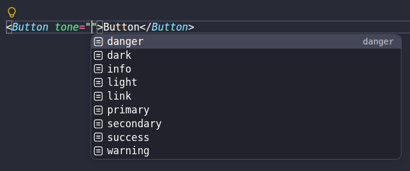

<br>
<p align="center">
  
</p>

<p align="center">
  
  
  
  
  
</p>

<div align="center">

# BSUI

**Modern Bootstrap component system for React applications. Build Bootstrap 5 applications with composable React components, utility props, and JSDoc-powered IntelliSense.**

</div>

## Features

- Bootstrap 5 Components
- Validated Bootstrap Utility Props
- Consistent Component API
- Bootstrap-Compatible Architecture
- Zero Bootstrap JavaScript Dependency
- JSDoc-Powered IntelliSense
- Interactive Documentation

## Installation

Requirements:

- React 19+
- Bootstrap 5.1.3

Install BSUI:

```bash
npm i @promethey/bsui
```

Install Bootstrap:

```bash
npm i bootstrap
```

Import Bootstrap styles in your application entry point:

```js
import "bootstrap/dist/css/bootstrap.min.css";
```

### Usage

```jsx
import "bootstrap/dist/css/bootstrap.min.css";
import { Button } from "@promethey/bsui";

export function Example() {
  return (
    <Button tone="primary" size="lg">
      Hello BSUI
    </Button>
  );
}

/**
 * <button class="btn btn-primary btn-lg">
 *    Hello BSUI
 * </button>
 */
```

## Prime-Based Architecture

Every BSUI component is built on top of `Prime`, the
foundation component of the library.

Bootstrap utility props, responsive object syntax,
and common styling capabilities are inherited by every
BSUI component through the `Prime` foundation.

```jsx
<Prime
  d="flex"
  bg={{ color: "primary", opacity: 25 }}
  flex={{
    xs: {
      justifyContent: "center",
      alignItems: "end",
    },
    md: {
      justifyContent: "start",
      alignItems: "start",
    },
  }}
  mt={{ xs: 3, md: 0 }}
  p={{ xs: 3, md: 4 }}
/>
```

```jsx
<Card
  d="flex"
  bg={{ color: "primary", opacity: 75 }}
  text="light"
  flex={{ justifyContent: "center", alignItems: "start" }}
  mt={{ xs: 2, md: 4 }}>
  <Card.Body>
    <Card.Title fw="bolder">Card title</Card.Title>
    <Card.Text>Some quick example text</Card.Text>
  </Card.Body>
</Card>
```

Whether working with `Card`, `Button`, `Navbar`, or any other component,
the same `Prime` API is available throughout the library.

As a result, developers learn the `Prime` API once and use
the same patterns consistently throughout the library.

## Type Safety without TypeScript

Build React applications with rich editor support without requiring TypeScript.

BSUI combines JSDoc annotations and PropTypes to provide:

- Autocomplete and IntelliSense
- Inline API documentation
- Development-time type hints
- Runtime prop validation
- No additional TypeScript tooling required



## Why tone?

BSUI uses the `tone` prop to control the visual appearance of components.

Unlike `variant`, the name **tone** is shorter, easier to type, and better reflects the semantic purpose of the prop.

```jsx
<Button tone="primary" />
```

```jsx
<Alert tone="danger" />
```

Using a single semantic prop across the component library provides a more consistent and predictable API.

## External Libraries

- [React Transition Group](https://reactcommunity.org/react-transition-group/) - animations and transitions
- [Embla Carousel](https://www.embla-carousel.com/) - carousel engine
- [Floating UI](https://floating-ui.com/) - dropdowns, tooltips, popovers, and positioning

## Contributing

Contributions are welcome!

Before opening a pull request, please read the
[Contributing Guide](CONTRIBUTING.md).

## License

MIT © Egor Sedelkov
